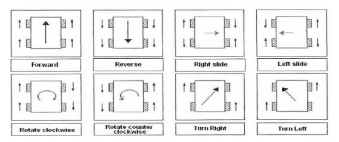

## DRI0040 double motors driver

https://wiki.dfrobot.com/Dual_1.5A_Motor_Driver_-_HR8833_SKU__DRI0040

The IA1 and IA2 input pins control the state of the MA1 and MA2 outputs; similarly, the IB1 and IB2 input pins control the state of the MB1 and MB2 outputs. Below table shows the logic.
|Ix1|Ix2|Mx1|Mx2|Function
|--|--|--|--|--|
|0|0|Z|Z|Coast/fast decay
|0|1|L|H|Reverse
|1|0|H|L|Forward
|1|1|L|L|Brake/slow decay

The inputs can also be used for PWM control of the motor speed. When controlling a winding with PWM, when the drive current is interrupted, the inductive nature of the motor requires that the current must continue to flow.This is called recirculation current. To handle this recirculation current, the H-bridge can operate in two different states, fast decay or slow decay. In fast decay mode, the H-bridge is disabled and recirculation current flows through the body diodes; in slow decay, the motor winding is shorted. To PWM using fast decay, the PWM signal is applied to one Ix pin while the other is held low; to use slow decay, one Ix pin is held high.
|Ix1|Ix2|Function|Description
|--|--|--|--|
|PWM|0|Forward PWM,fast decay|Speed = High duty-cycle
1|PWM|Forward PWM,slow decay|Speed = Low duty-cycle
0|PWM|Reverse PWM,fast decay|Speed = High duty-cycle
PWM|1|Reverse PWM,slow decay|Speed = Low duty-cycle

## Driectionning

### Theory

### Movements table in this case
| | | |
|--:|--:|--:|
|Turn Left : **`5`**|Forward : **`1`**|Turn Right : **`6`** |
|Slide Left : **`3`**|Stop : **`0`**|Slide Right : **`4`** |
|Rotation CCW : **`7`**|Backward : **`2`**|Rotation CW : **`8`** |

Raspberry publish mqtt with an integer. ESP32 subscribe to the topic, a switch/case structure send where and how the robot goes. 

## Setup RaspberryPi 

### Mosquitto

Follow https://randomnerdtutorials.com/how-to-install-mosquitto-broker-on-raspberry-pi/

    sudo apt update && sudo apt upgrade && sudo apt install -y mosquitto mosquitto-clients
    sudo systemctl enable mosquitto.service
    sudo nano /etc/mosquitto/mosquitto.conf

add in the end of the .conf file : 

    listener 1883
    allow_anonymous true

`sudo reboot`

`hostname -I`

### NodeRed

Follow https://randomnerdtutorials.com/getting-started-with-node-red-on-raspberry-pi/

**Install Node-RED :** 

    bash <(curl -sL https://raw.githubusercontent.com/node-red/linux-installers/master/deb/update-nodejs-and-nodered)
    sudo systemctl enable nodered.service
    sudo reboot

check with browser : 
`http//IP_ADD_RASP:1880`

**Install Node-RED Dashboard :** 

    node-red-stop
    cd ~/.node-red
    npm install node-red-dashboard
    sudo reboot

check with browser : 
`http//IP_ADD_RASP:1880/ui`

## ESP32 

### Mqtt Subscribe
Follow : https://techtutorialsx.com/2017/04/24/esp32-subscribing-to-mqtt-topic/

Documentation : https://pubsubclient.knolleary.net/api
See **_Subscription Callback_** at the bottom of the page

In the code, all the parameters should be in the **_void callBack()_** function as the example.
